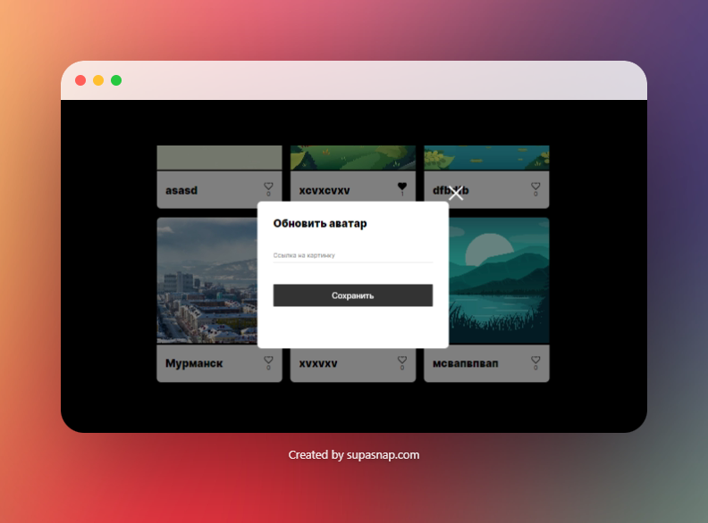
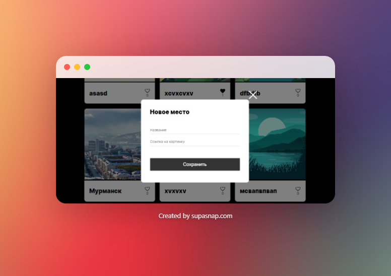
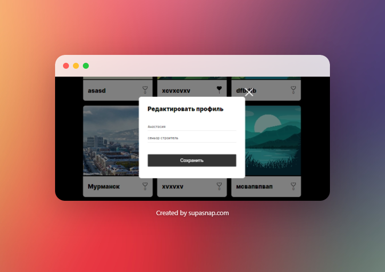

# Проектная работа Mesto

Этот проект выполнен в рамках обучения в Яндекс.Практикуме. Проект представляет собой веб-приложение для обмена фотографиями мест. Пользователи могут редактировать свой профиль, добавлять новые места, ставить лайки другим местам и удалять их.

## Демо

Вы можете ознакомиться с демонстрацией проекта по ссылке: 
[Демо](https://nestlir.github.io/mesto-project-ff/)


Обновление автара:


Добавление карточки с новым местом:


Открытие картинки при нажатие:


Редактирование профиля:



## Функциональность

- Валидация форм редактирования профиля и добавления нового места.
- Интеграция с API для загрузки информации о пользователе и местах.
- Добавление, удаление и лайки мест.
- Возможность изменять аватар пользователя.

## Технологии

- HTML
- CSS
- JavaScript
- API

## Установка

1. Клонируйте репозиторий:

```bash
git clone https://github.com/nestlir/mesto-project-ff.git

# Использование

- **Редактирование профиля:** Нажмите на кнопку "Редактировать профиль", внесите необходимые изменения в поля и нажмите "Сохранить".

- **Добавление нового места:** Нажмите на кнопку "Добавить место", введите название и ссылку на изображение, затем нажмите "Создать".

- **Лайки:** Нажмите на иконку сердца, чтобы поставить лайк месту.

- **Удаление места:** Нажмите на иконку корзины, чтобы удалить место.

# Улучшения

- Проверка ошибок при редактировании данных пользователя.
  
- Использование Network для отслеживания запросов.
  
- Добавление всплывающего окна для подтверждения удаления места.

# API

Для взаимодействия с сервером используются следующие эндпоинты:

- Получение информации о пользователе: `GET https://mesto.nomoreparties.co/users/me`

- Редактирование профиля пользователя: `PATCH https://mesto.nomoreparties.co/users/me`

- Получение списка мест: `GET https://mesto.nomoreparties.co/cards`

- Добавление нового места: `POST https://mesto.nomoreparties.co/cards`

- Удаление места: `DELETE https://mesto.nomoreparties.co/cards/:cardId`

- Поставить лайк месту: `PUT https://mesto.nomoreparties.co/cards/likes/:cardId`

- Удалить лайк с места: `DELETE https://mesto.nomoreparties.co/cards/likes/:cardId`

Поставить лайк месту: PUT https://mesto.nomoreparties.co/cards/likes/:cardId

Удалить лайк с места: DELETE https://mesto.nomoreparties.co/cards/likes/:cardId.
